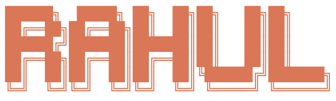

```
██████╗  █████╗ ██╗  ██╗██╗   ██╗██╗     
██╔══██╗██╔══██╗██║  ██║██║   ██║██║     
██████╔╝███████║███████║██║   ██║██║     
██╔══██╗██╔══██║██╔══██║██║   ██║██║     
██║  ██║██║  ██║██║  ██║╚██████╔╝███████╗
╚═╝  ╚═╝╚═╝  ╚═╝╚═╝  ╚═╝ ╚═════╝ ╚══════╝
```

<p align="center">
  
</p>

<p align="center">
  <a href="https://git.io/typing-svg">
    
  </a>
</p>

```
╭─────────────────────────────────────────────╮
│  > whoami                                  │
╰─────────────────────────────────────────────╯

>_ rahul — agentic AI engineer, toronto
>_ if it's annoying, i've probably already automated it
```

```
>_ building       ShoeLlama (agentic RAG) + Autonomous Shoe Spotter (CV)
>_ learning       MCP, LangGraph deep dives, agent evaluation
>_ side quest     Qiskit (do i understand it? too early to say)
>_ open to        full-time opportunities in AI / ML
```

---

**`# programming`**


**`# ai / ml & agentic frameworks`**


**`# cloud & deployment`**


**`# devops & tooling`**


**`# data & other`**


---

```
╭─────────────────────────────────────────────╮
│  > ls ./projects                           │
╰─────────────────────────────────────────────╯
```

- >_ [**ShoeLlama**](https://github.com/Rahul0911/ShoeLlama) — agentic RAG system — Agentic RAG over 1,600+ products with hybrid search, reranking & memory — because product knowledge shouldn't live in one associate's head
- >_ [**Autonomous Shoe Spotter**](https://github.com/Rahul0911/Autonomous-Shoe-Spotter) — computer vision inventory spotter — YOLO model trained on 10K+ self-labeled images to find misplaced stock before a customer notices it's missing
- >_ [**Sustainable Predictive Maintenance**](https://github.com/Rahul0911/Sustainable-Predictive-Maintenance) — deep learning model predicting equipment failure types at 86% accuracy, deployed via FastAPI + Docker on GCP & Hugging Face

---

<p align="center">
  
  
</p>

<p align="center">
  
</p>

---

<p align="center">
  <a href="https://linkedin.com/in/rahul0911"></a>
  <a href="mailto:yadavrahul9966@gmail.com"></a>
</p>

```
╭─────────────────────────────────────────────────╮
│  toronto, canada  ·  open to full-time ai/ml  │
╰─────────────────────────────────────────────────╯
```
